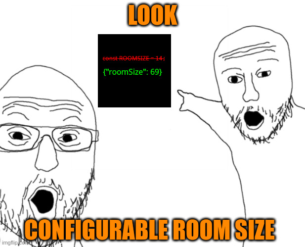

# Vintage Story - Configurable Room Size Mod

This mod allows you to configure maximum room sizes in Vintage Story, so you can create larger interiors and still be warm.



## How to use:

After launching the game with the mod, just edit the `ConfigurableRoomSize.json` file in the ModConfig folder.

```[json]
{
  "MaxRoomSize": 24,
  "MaxCellarSize": 7,
  "AltMaxCellarSize": 9,
  "AltMaxCellarVolume": 150
}
```

That's all!

### Note:

- If you are using mods like "Status Hud Continued" client has to have the same config as the server to properly display the room icon.
